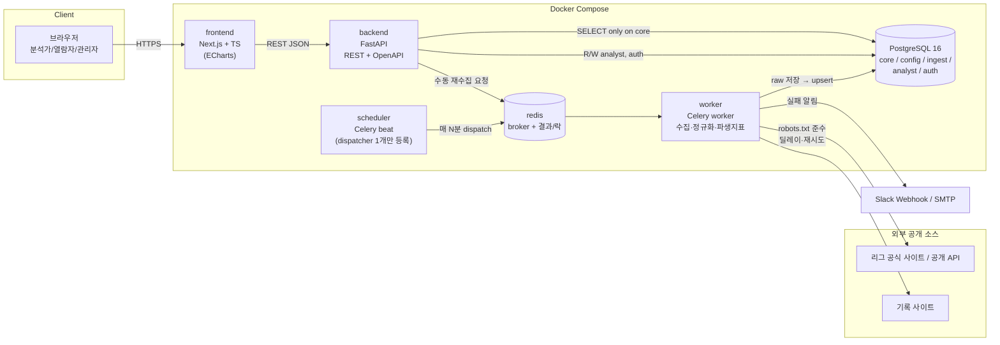
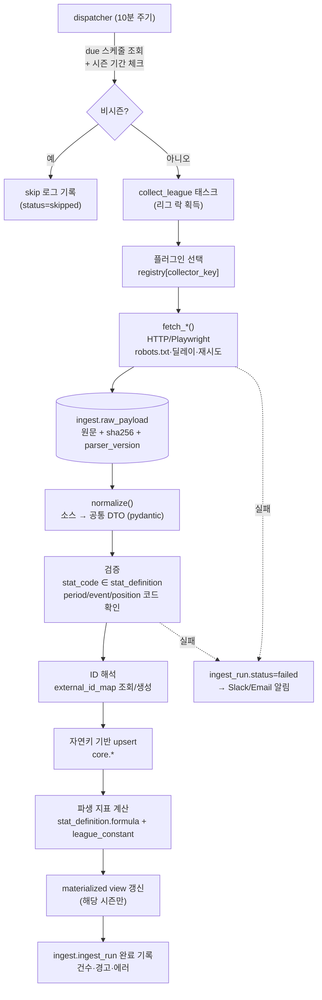

# 1단계 (1/3) · 전체 아키텍처

> 멀티 스포츠 데이터 분석 플랫폼 — 시스템 구성, 컴포넌트 책임, 데이터 흐름, 확장 방식
>
> 관련 문서: [02-data-model.md](./02-data-model.md) (데이터 모델·저장 방식 비교·ERD),
> [03-assumptions-and-questions.md](./03-assumptions-and-questions.md) (가정·확인 필요 사항)

---

## 1. 설계 목표 요약

| 목표 | 설계상 해결 방법 |
|---|---|
| 매일 자동 수집·갱신 | 리그별 스케줄 설정 + Celery 워커 + 플러그인 수집기, raw/clean 분리 저장 |
| 분석가 직접 입력 데이터 결합 | `analyst` 스키마로 물리적으로 분리, 공통 엔티티 ID로 조인, 변경 이력 자동 기록 |
| 새 종목 추가 시 핵심 코드 무수정 | **종목 설정(YAML → config 테이블) + 수집 플러그인** 두 가지만 추가. 기록 값은 JSONB에 지표 코드로 저장하므로 DDL 변경 없음 |
| 자동 수집 데이터 수정 불가 | DB 권한 분리: API 서버 계정은 `core` 스키마에 `SELECT`만 보유. 쓰기는 수집 워커 계정만 가능 |
| 출처·갱신 시각 표시 | 모든 수집 레코드에 `source_id`, `ingest_run_id`, `collected_at` 컬럼. API 응답에 `provenance` 블록 포함 |
| 종목별 `if` 분기 금지 | 화면·계산·검증이 모두 `stat_definition` 등 설정 테이블을 읽어 동작. 종목별 로직은 플러그인 내부에만 존재 |

---

## 2. 시스템 구성도



### 컨테이너별 책임

| 컨테이너 | 책임 | 비고 |
|---|---|---|
| `frontend` | 종목·리그·시즌 선택기, 대시보드, 상세/비교/리더보드, 입력 폼, 내보내기(PNG는 클라이언트 측) | `GET /sports/{code}/config` 응답으로 표 컬럼·차트 축·스플릿 옵션을 동적 구성 |
| `backend` | 인증/인가, 조회 API, 분석가 입력 CRUD, CSV 업로드 검증, 커스텀 지표 계산, CSV/Excel 내보내기, (선택) 읽기 전용 SQL 콘솔 | DB 계정 `app_api` 사용 — `core`/`config` 읽기 전용 |
| `worker` | 수집 플러그인 실행, raw 저장, 정규화·upsert, 파생 지표 배치 계산, materialized view 갱신, 알림 | DB 계정 `app_ingest` 사용 — `core`/`ingest` 쓰기 가능 |
| `scheduler` | Celery beat. **dispatcher 태스크 하나만** 주기적으로(기본 10분) 실행 | 리그별 수집 시각은 DB의 `ingest.collection_schedule`에서 읽음 → 스케줄 변경 시 재배포 불필요 |
| `redis` | Celery broker, 리그 단위 분산 락(동일 리그 중복 실행 방지) | |
| `db` | PostgreSQL 16 | `NULLS NOT DISTINCT` 유니크 제약, JSONB, 파티셔닝 활용 |

### 스케줄러 선택: Celery + Redis (APScheduler 대신)

- 종목 4개 × 리그 수 개로 시작하지만, 경기 종료 시각이 종목·리그마다 달라 **작업이 하루 종일 분산**된다.
- Playwright 기반 수집은 메모리를 많이 쓰므로 **워커 큐를 분리**(`http` 큐 / `browser` 큐)할 수 있어야 한다.
- APScheduler는 단일 프로세스 내 스케줄링이라 워커 수평 확장·재시도·큐 분리가 어렵다.
- 따라서 처음부터 Celery를 쓰되, beat에는 dispatcher 하나만 두고 **실제 일정은 DB 설정으로 관리**한다.

---

## 3. 수집 파이프라인



### 핵심 규칙

1. **raw 우선 저장**: 파싱 이전에 원문(HTML/JSON)을 `ingest.raw_payload`에 저장한다. 동일 내용(sha256 동일)은 중복 저장하지 않는다.
   → 소스 구조가 바뀌어 파서를 고치면 `reprocess --league KBO --season 2026 --parser-version 3` 명령으로 raw부터 재처리한다(재요청 없음).
2. **정규화 책임은 플러그인**: 플러그인은 소스 고유 구조를 공통 DTO(`MatchDTO`, `PlayerMatchStatDTO`, `EventDTO` …)로 변환해 반환한다. 이후 저장·ID 매핑·파생 계산은 **공통 코드**가 수행한다.
3. **upsert 키**: 1순위 `external_id_map(source, entity_type, external_id)`, 2순위 엔티티별 자연키(예: 경기 = 리그+시즌+일자+홈+원정+더블헤더 순번). 자세한 키는 [02-data-model.md §5](./02-data-model.md#5-자연키와-upsert-전략).
4. **비시즌 자동 건너뛰기**: `core.season.start_date/end_date`(+ 스테이지 기간)와 `collection_schedule.offseason_policy`로 판단. 비시즌에도 주 1회 선수 명단/이적 수집 같은 예외는 스케줄 단위로 허용.
5. **정중한 수집**: 플러그인 공통 HTTP 클라이언트가 robots.txt 캐시·도메인별 최소 요청 간격·지수 백오프 재시도(최대 N회)·식별 가능한 User-Agent를 강제한다. 개별 플러그인이 우회할 수 없다.
6. **알림**: 실패, 또는 "경기 종료 상태인데 박스스코어 0건" 같은 이상 징후(경고)는 Slack Webhook/이메일로 발송. 동일 리그 연속 실패는 묶어서 1회만 보낸다.

### 수집 플러그인 인터페이스 (3단계에서 구현, 여기서는 형태만)

```python
# backend/collectors/core/interface.py  (개략)
class CollectorPlugin(Protocol):
    key: str                 # 예: "kbo_official"  → config의 league.collector_key와 매칭
    sport_code: str          # 예: "baseball"
    source_code: str         # data_source.code

    def fetch_schedule(self, ctx: RunContext, date_from: date, date_to: date) -> list[RawDocument]: ...
    def fetch_match(self, ctx: RunContext, external_match_id: str) -> list[RawDocument]: ...
    def fetch_player_stats(self, ctx: RunContext, season: SeasonRef) -> list[RawDocument]: ...
    def fetch_standings(self, ctx: RunContext, season: SeasonRef) -> list[RawDocument]: ...

    # raw → 공통 DTO. 네트워크 접근 금지(재처리 가능성 보장)
    def normalize(self, doc: RawDocument) -> NormalizedBundle: ...
```

- `fetch_*`는 **원문만** 반환하고, `normalize`는 **순수 함수**로 둔다. 이 분리가 "raw 재처리"를 가능하게 하는 핵심이다.
- 플러그인 등록: `@register_collector` 데코레이터 + `collectors/plugins/` 패키지 자동 탐색(또는 Python entry point). 핵심 코드에 import 추가 불필요.

---

## 4. 백엔드 모듈 구조 (예정)

```
backend/
  app/
    api/            # FastAPI 라우터 (sports, leagues, matches, players, teams, stats, leaderboards, analyst/*, admin/*)
    services/       # 조회·스플릿·비교·내보내기 로직 (종목 무관)
    auth/           # 이메일 로그인, JWT(httpOnly 쿠키), 역할 검사
    db/             # SQLAlchemy 세션, 쿼리 빌더
  stats_engine/
    formula.py      # 안전한 수식 DSL 파서/평가기 (eval 미사용, 화이트리스트 연산자·함수)
    derive.py       # stat_definition 기반 파생 지표 배치 계산 (match/season 레벨)
    aggregate.py    # 집계 방식(sum/avg/max/min/formula)별 롤업
  collectors/
    core/           # 인터페이스, HTTP 클라이언트(robots·딜레이·재시도), DTO, 검증, ID 해석, upsert
    plugins/        # 종목·리그별 플러그인 (baseball_kbo/, basketball_kbl/, ...)
  worker/           # Celery 앱, dispatcher, collect/derive/refresh 태스크, 알림
  migrations/       # Alembic (SQL 중심)
config/
  sports/           # baseball.yaml, basketball.yaml, volleyball.yaml, football.yaml
  leagues/          # kbo.yaml 등: 리그·수집 스케줄·collector_key
frontend/           # Next.js (app router)
docker-compose.yml
```

### "새 종목 추가" 시 필요한 작업 (목표 상태)

| 작업 | 파일 | 핵심 코드 수정 |
|---|---|---|
| 종목 설정: 구간·포지션·이벤트 타입·지표 정의·스플릿·리더보드 자격 조건 | `config/sports/icehockey.yaml` | 없음 |
| 리그 설정: 시즌·수집 스케줄·collector_key | `config/leagues/nhl.yaml` | 없음 |
| 수집 플러그인: fetch + normalize | `collectors/plugins/icehockey_nhl/` | 없음 |
| 설정 반영 | `python -m app.cli sync-config` (YAML → config 테이블 upsert) | 없음 |
| (필요 시) 종목 특화 스플릿이 이벤트 속성 기반이면 `split_definition`에 속성 경로만 추가 | YAML | 없음 |

---

## 5. 프론트엔드 동작 원리 (설정 주도 UI)

1. 상단 선택기: `sport → league → season(→ stage)`. 선택 상태는 URL 쿼리(`?sport=baseball&league=KBO&season=2026`)에 유지 → 저장된 뷰·공유 링크가 자연스럽게 동작.
2. 선택 즉시 `GET /api/sports/{sport}/config` 호출 → 응답:
   - `stat_definitions[]` (코드, 표시명, 카테고리, 단위, 소수점, higher_is_better, 레벨)
   - `period_definitions[]`, `positions[]`, `event_types[]`, `split_definitions[]`, `qualification_rules[]`
3. 공통 컴포넌트 `<StatTable>`, `<TrendChart>`, `<RadarCompare>`, `<Leaderboard>`, `<SplitTable>`는 이 설정만으로 컬럼·포맷·정렬·축을 생성한다. 종목 이름으로 분기하는 코드는 두지 않는다.
4. 표시 규칙: 자동 수집 값과 분석가 입력 값은 **배지·색상으로 구분**하고, 모든 표·차트 하단에 `출처: {source.name} · 마지막 갱신: {collected_at}`을 표시한다.

---

## 6. 보안·권한 개요

| 역할 | 수집 데이터 | 분석가 입력 데이터 | 설정/템플릿 | 수집 운영 |
|---|---|---|---|---|
| 관리자 | 읽기 | 읽기/쓰기(전체) | 쓰기 | 재수집 실행, 로그 조회 |
| 분석가 | 읽기 | 본인 작성 쓰기, 팀 공유분 읽기 | 읽기 | 로그 조회 |
| 열람자 | 읽기 | 팀 공유분 읽기 | 읽기 | — |

- 애플리케이션 레벨 권한 검사 + `analyst` 스키마에 **PostgreSQL RLS**(Row Level Security)로 이중 방어. API는 요청마다 `SET LOCAL app.user_id = …`를 설정하고, RLS 정책과 변경 이력 트리거가 이 값을 사용한다.
- (선택) SQL 콘솔은 별도 DB 계정 `app_readonly`(core/config/analyst 뷰에 SELECT만, `statement_timeout` 10초, 행 수 제한)로 실행하고, analyst 데이터는 RLS가 적용된 뷰로만 노출한다.
