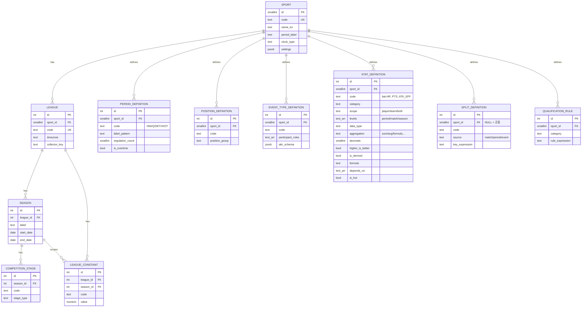
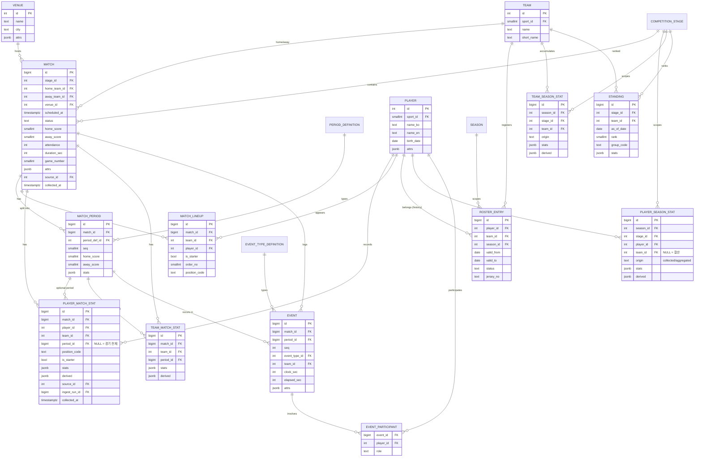
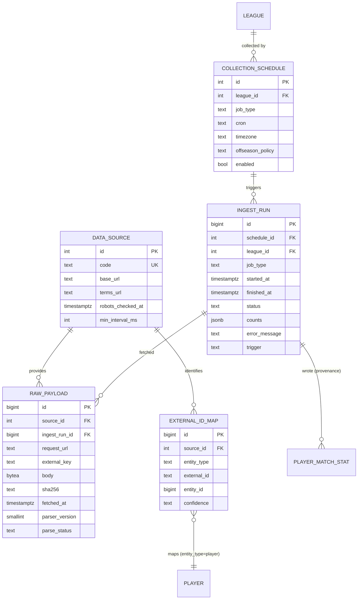

# 1단계 (2/3) · 종목 독립적 데이터 모델 & ERD

> 관련 문서: [01-architecture.md](./01-architecture.md), [03-assumptions-and-questions.md](./03-assumptions-and-questions.md),
> [04-stage2-schema.md](./04-stage2-schema.md) (2단계 구현 및 설계 변경 사항)

---

## 1. 스키마(네임스페이스) 분리

PostgreSQL 스키마를 책임 단위로 나눠 권한과 성격을 명확히 한다.

| 스키마 | 내용 | 쓰기 주체 | 사용자 수정 |
|---|---|---|---|
| `config` | 종목·지표 정의·구간·포지션·이벤트 타입·스플릿·자격 조건·리그 상수 | 관리자(설정 동기화 CLI / 관리 화면) | 관리자만 |
| `core` | 공통 엔티티 + 자동 수집 기록 (경기, 선수, 기록, 이벤트, 순위…) | **수집 워커만** | **불가** |
| `ingest` | 데이터 소스, 수집 스케줄, 수집 실행 로그, raw 원문, 외부 ID 매핑 | 수집 워커 | 불가 |
| `analyst` | 스카우팅, 부상 메모, 태그, 커스텀 지표, 수동 업로드, 저장된 뷰, 변경 이력 | API(분석가·관리자) | 가능(권한 내) |
| `auth` | 사용자, 워크스페이스(분석 팀), 역할, 세션 | API | 본인/관리자 |

> 용어 구분: **스포츠 팀**은 `core.team`, 분석가들이 속한 **조직(구단 분석팀·매체 등)**은 `auth.workspace`로 부른다. "팀 공유" 공개 범위는 `workspace` 단위 공유를 뜻한다.

---

## 2. 기록 값 저장 방식 비교 (EAV vs JSONB vs 종목별 확장 테이블)

### 2.1 세 가지 후보

**A. EAV (Entity–Attribute–Value)**
```sql
player_match_stat_value(player_match_id, stat_code, value numeric)  -- 지표 1개당 1행
```

**B. JSONB**
```sql
player_match_stat(match_id, player_id, ..., stats jsonb)  -- {"bat.PA":4,"bat.H":2,"bat.HR":1}
```

**C. 종목별 확장 테이블 (Class Table Inheritance)**
```sql
player_match_stat(match_id, player_id, ...)            -- 공통
baseball_batting_match_stat(player_match_id, pa, ab, h, hr, ...)  -- 종목별 컬럼
basketball_player_match_stat(player_match_id, pts, reb, ast, ...)
```

### 2.2 비교

| 기준 | A. EAV | B. JSONB | C. 확장 테이블 |
|---|---|---|---|
| 새 종목/지표 추가 시 DDL | 불필요 ✅ | 불필요 ✅ | **필요** ❌ (테이블·ORM·마이그레이션) |
| "플러그인+설정만 추가" 목표 부합 | ✅ | ✅ | ❌ |
| 지표 코드 무결성 | FK로 `stat_definition` 강제 가능 ✅ | DB 레벨 강제 어려움 ⚠️ (앱 검증 필요) | 컬럼 자체가 스키마 ✅ |
| 값 타입 안정성 | `numeric` 단일 타입(문자열 지표 별도 처리) ⚠️ | 키마다 자유 ⚠️ (앱 검증) | 컬럼 타입 ✅ |
| 저장 행 수 (MLB 1시즌 선수-경기 약 12만 건 × 지표 60개 가정) | **약 720만 행**/시즌 ❌ | 약 12만 행 ✅ | 약 12만 행 ✅ |
| 박스스코어 1경기 조회 | 피벗 필요(크로스탭) ⚠️ | 행 그대로 반환 ✅ | 종목별 JOIN ⚠️ |
| 특정 지표 리더보드/정렬 | `(stat_code, value)` 인덱스로 매우 빠름 ✅ | 식 인덱스 필요(지표마다) ⚠️ | 컬럼 인덱스 ✅ |
| 여러 지표 조건 필터 (예: HR≥20 AND SB≥20) | 셀프 조인 N번 ❌ | `(stats->>'x')::numeric` 조건 ✅ | ✅ |
| 종목 간 공통 쿼리 | 공통 ✅ | 공통 ✅ | 종목별 UNION ❌ |
| API/프론트 직렬화 | 피벗 후 변환 | 거의 그대로 ✅ | 종목별 스키마 코드 ❌ |
| 파생 지표 계산 | 피벗 후 계산 | dict 그대로 계산기에 투입 ✅ | 종목별 코드 ❌ |
| 희소 데이터(제공 범위가 리그마다 다름) | 행 없음으로 자연 표현 ✅ | 키 없음으로 자연 표현 ✅ | NULL 컬럼 다수 ⚠️ |
| 쓰기(upsert) 비용 | 지표 수만큼 행 upsert ❌ | 1행 upsert ✅ | 2행 upsert |

### 2.3 채택안: **"JSONB 본체 + 설정 기반 검증 + 읽기용 롱포맷(EAV형) Materialized View"** 하이브리드

1. **저장(쓰기 모델) = JSONB**
   - 모든 기록 테이블(`player_match_stat`, `team_match_stat`, `player_season_stat`, `team_season_stat`)은
     `stats jsonb`(수집 원시 지표) + `derived jsonb`(파생 지표, 배치 계산 결과)를 가진다.
   - 수집 원시 값과 파생 값을 컬럼으로 분리해, 파생 계산을 **언제든 전체 재계산 가능(멱등)** 하게 한다.
   - 지표 키는 `stat_definition.code`와 동일한 **네임스페이스 코드**를 쓴다: `bat.HR`, `pit.HR`처럼
     같은 약어라도 카테고리로 구분(야구 타자 홈런 vs 투수 피홈런 충돌 방지).
2. **무결성 = 애플리케이션 + DB 보조 장치**
   - 정규화 단계에서 `stat_definition`으로부터 동적으로 생성한 pydantic 모델로 키·타입 검증(모르는 키는 거부 + 경고 로그).
   - DB에는 `CHECK (jsonb_typeof(stats) = 'object')` + 야간 정합성 점검 쿼리(정의되지 않은 키 탐지)를 둔다.
     (삽입마다 `stat_definition`을 조회하는 트리거는 대량 적재 성능 때문에 기본 비활성, 옵션으로 제공)
3. **읽기 최적화 = 롱포맷 MV (EAV의 장점만 취함)**
   - `core.mv_player_season_stat_long(season_id, stage_id, player_id, team_id, stat_code, value)`
     `core.mv_team_season_stat_long(...)` 를 JSONB에서 `jsonb_each`로 펼쳐 생성하고
     `(season_id, stat_code, value DESC)` 인덱스를 건다.
   - → **어떤 지표든** 종목별 DDL 없이 빠른 리더보드·순위·백분위 계산 가능.
   - 시즌 단위라 행 수가 작다(KBO 1시즌 선수 ~600명 × 지표 ~80 = 약 5만 행).
4. **핫 지표 보조 인덱스(선택)**: `stat_definition.is_hot = true`인 지표만 설정 동기화 시
   `player_match_stat`에 식 인덱스(`((stats->>'bat.HR')::numeric)`)를 자동 생성. 종목 추가 시에도 설정만으로 동작.
5. **공통 필수 값은 일반 컬럼**: 출전 여부, 선발 여부, 포지션, 출전 시간(초) 등 **모든 종목에 공통으로 필요하고 조인·필터에 자주 쓰이는 값**만 정식 컬럼으로 둔다.

**C안(확장 테이블)을 배제한 이유**: 성능·타입 안정성은 가장 좋지만, 요구사항 3(설정+플러그인만으로 종목 추가)을 정면으로 위배한다.
**순수 A안을 배제한 이유**: 박스스코어·비교·파생 계산 등 대부분의 읽기가 "한 레코드의 여러 지표"를 필요로 하는데 EAV는 매번 피벗이 필요하고 쓰기 행 수가 수십 배다. 대신 EAV가 강한 "지표별 정렬"은 MV로 흡수했다.

### 2.4 분석가 커스텀 지표 값

- 커스텀 지표는 **기본적으로 저장하지 않고 조회 시 계산**한다(사용자·워크스페이스별로 다르고, 수식 수정이 잦음).
- 리더보드 등 반복 조회 성능이 필요하면 `analyst.custom_metric_value`(롱포맷: metric_id, level, subject_id, season_id, value)에 캐시하고 원천 데이터 갱신 시 무효화한다. 사용자별·희소 데이터라 이 부분은 EAV형이 적합하다.

---

## 3. 핵심 엔티티 설명

### 3.1 설정 (`config`)

| 테이블 | 설명 | 주요 컬럼 |
|---|---|---|
| `sport` | 종목 | `code`(baseball…), `name_ko`, `name_en`, `period_label`(이닝/쿼터/세트/하프), `score_unit`(점/골/세트), `clock_type`(none/countdown/countup), `settings jsonb` |
| `period_definition` | 경기 구간 정의 | `sport_id`, `code`(`INN`, `Q`, `SET`, `H`, `OT`, `ET`, `PSO`), `label_pattern`('{n}회', '{n}쿼터'…), `regulation_count`, `is_overtime`, `nominal_duration_sec`, `sort_order` |
| `position_definition` | 포지션 | `sport_id`, `code`(P, C, 1B / PG, SG / OH, MB, L / GK, DF…), `name`, `position_group`, `sort_order` |
| `event_type_definition` | 이벤트 타입 | `sport_id`, `code`(PA, PITCH, SHOT, SUB, CARD, SERVE…), `name`, `participant_roles text[]`(batter, pitcher / shooter, assister…), `attr_schema jsonb`(JSON Schema) |
| `stat_definition` | **지표 메타데이터** | `sport_id`, `code`, `category`(batting/pitching/…), `name_ko`, `name_en`, `abbr`, `scope`(player/team/both), `levels text[]`(period/match/season), `unit`, `data_type`(int/decimal/percent/duration/text), `aggregation`(sum/avg/max/min/formula/none), `decimals`, `higher_is_better`, `is_derived`, `formula`, `depends_on text[]`, `is_hot`, `display_order`, `description` |
| `split_definition` | 스플릿 기준 | `sport_id`(NULL=공통), `code`(home_away, month, opponent, venue, vs_pitcher_hand, by_quarter…), `source`(match/period/event/player_attr), `key_expression`(예: `event.attrs.pitcher_hand`), `levels` |
| `qualification_rule` | 리더보드 최소 조건 | `sport_id`, `category`, `rule_expression`(예: `bat.PA >= 3.1 * team_games`), `description` |
| `league_constant` | 시즌별 리그 상수 | `league_id`, `season_id`, `code`(wOBA_wBB, FIP_C, lg_ERA…), `value`, `source`(collected/computed/manual) |

**stat_definition 예시**

| sport | code | category | aggregation | derived | formula |
|---|---|---|---|---|---|
| baseball | `bat.AVG` | batting | formula | ✅ | `bat.H / bat.AB` |
| baseball | `bat.OPS` | batting | formula | ✅ | `bat.OBP + bat.SLG` |
| baseball | `pit.FIP` | pitching | formula | ✅ | `(13*pit.HR + 3*(pit.BB+pit.HBP) - 2*pit.SO) / pit.IP + lg.FIP_C` |
| basketball | `TS_PCT` | shooting | formula | ✅ | `PTS / (2 * (FGA + 0.44*FTA))` |
| volleyball | `ATK_EFF` | attack | formula | ✅ | `(ATK_KILL - ATK_ERR - ATK_BLOCKED) / ATK_ATT` |
| football | `PASS_PCT` | passing | formula | ✅ | `PASS_CMP / PASS_ATT` |

- **비율 지표는 평균하지 않는다.** `aggregation = formula`인 지표는 상위 레벨(시즌)에서 구성 요소(합계)를 먼저 롤업한 뒤 수식을 다시 적용한다. (경기별 타율 평균 ≠ 시즌 타율)
- 수식은 전용 DSL(사칙연산, `min/max/if/safe_div`, 지표 코드, `lg.` 상수)로만 작성하며 `eval`을 쓰지 않는다. 의존성 그래프(`depends_on`)로 계산 순서를 위상 정렬하고, 순환 참조는 설정 동기화 시 거부한다.

### 3.2 공통 엔티티 (`core`)

| 테이블 | 설명 | 비고 |
|---|---|---|
| `league` | 리그/대회 | `sport_id`, `code`, `country`, `level`, `timezone`, `collector_key` |
| `season` | 시즌 | `league_id`, `label`('2026', '2025-26'), `start_date`, `end_date`, `status` |
| `competition_stage` | 정규시즌/플레이오프/컵 라운드 | `season_id`, `code`, `stage_type`(regular/postseason/preseason/group/knockout), 기간, `sort_order` |
| `team` | 스포츠 팀 | `sport_id`, `name`, `short_name`, `founded`… (시즌별 명칭 변경은 `team_name_history`) |
| `player` | 선수 | 이름(한/영), 생년월일, 국적, 신장/체중, `bats/throws/foot` 등 종목 속성은 `attrs jsonb` |
| `venue` | 경기장 | 이름, 도시, 수용 인원, 좌표, `attrs jsonb`(돔 여부, 잔디 종류 등) |
| `roster_entry` | 소속·등록 이력 | `player_id`, `team_id`, `season_id`, `valid_from`, `valid_to`, `status`(active/injured_list/loan…), `jersey_no`, `position_code` |
| `match` | 경기 | `stage_id`, `home_team_id`, `away_team_id`, `venue_id`, `scheduled_at`(timestamptz), `status`(scheduled/live/final/postponed/cancelled/suspended), `home_score`, `away_score`, `result_type`(regulation/OT/SO…), `attendance`, `duration_sec`, `game_number`(더블헤더), `attrs jsonb` |
| `match_period` | 경기 구간 | `match_id`, `period_def_id`, `seq`(1..n), `home_score`, `away_score`, `duration_sec`, `stats jsonb`(구간별 팀 기록 필요 시) |
| `match_lineup` | 선발/출전 명단 | `match_id`, `team_id`, `player_id`, `is_starter`, `batting_order`/`shirt_no`, `position_code` |
| `player_match_stat` | 선수 경기 기록 | `match_id`, `player_id`, `team_id`, **`period_id`(NULL=경기 전체)**, 공통 컬럼(`position_code`, `is_starter`), `stats`, `derived` (출전 시간은 종목 지표 `SEC`로 stats에 저장) |
| `team_match_stat` | 팀 경기 기록 | `match_id`, `team_id`, `period_id`, `stats`, `derived` |
| `player_season_stat` | 선수 시즌 누적 | `season_id`, `stage_id`, `player_id`, `team_id`(NULL=시즌 합산, 이적 시 팀별+합계), `origin`(collected/aggregated), `stats`, `derived` |
| `team_season_stat` | 팀 시즌 누적 | 동일 구조 |
| `standing` | 순위표 스냅숏 | `stage_id`, `team_id`, `as_of_date`, `rank`, `group_code`, `stats jsonb`(W/L/D/승점/세트득실 등 — 종목별 순위 지표도 `stat_definition` category=`standing`) |
| `event` | 경기 내 이벤트 | `match_id`, `period_id`, `seq`, `event_type_id`, `team_id`, `clock_sec`, `elapsed_sec`, `score_home_after`, `score_away_after`, `attrs jsonb` — **시즌 기준 파티셔닝** |
| `event_participant` | 이벤트 참여자 | `event_id`, `player_id`, `role`(batter/pitcher/shooter/assister/player_in/player_out…) |

**구간(Match Period) 통합 표현 방식**

| 종목 | period_definition 예 | seq 예 |
|---|---|---|
| 야구 | `INN`(9, 연장 동일 코드·`is_overtime` 판단은 seq > regulation_count) | 1~12 |
| 농구 | `Q`(4), `OT`(0, 반복) | Q1~Q4, OT1… |
| 배구 | `SET`(최대 5, 5세트 15점) | 1~5 |
| 축구 | `H`(2), `ET`(2), `PSO`(승부차기) | H1, H2, ET1, ET2, PSO |

- 구간 단위 선수 기록(농구 쿼터별, 배구 세트별)도 **같은 `player_match_stat` 테이블**에 `period_id`만 채워 저장한다. 테이블을 늘리지 않고 "쿼터별/세트별 스플릿"이 자연스럽게 된다.
- 소스가 구간별 기록을 제공하지 않으면 이벤트 로그에서 파생(가능한 경우)하거나 비워둔다. 유니크 키: `(match_id, player_id, period_id) NULLS NOT DISTINCT`.

**시즌 기록의 두 출처 (`origin`)**
- `collected`: 소스가 제공하는 공식 시즌 누적. 화면 기본값.
- `aggregated`: 우리가 경기 기록을 합산한 값. 스플릿·기간 필터의 기반이며, 매일 `collected`와 비교해 차이가 크면 경고(수집 누락 탐지)로 활용.

### 3.3 수집 관리 (`ingest`)

| 테이블 | 설명 |
|---|---|
| `data_source` | 소스 사이트: `code`, `name`, `base_url`, `terms_url`, `robots_checked_at`, `terms_note`, `min_interval_ms`, `license_note` |
| `collection_schedule` | 리그별 수집 작업: `league_id`, `job_type`(schedule/results/boxscore/events/season_stats/standings/roster), `cron`, `timezone`, `offseason_policy`(skip/weekly/run), `enabled`, `params jsonb` |
| `ingest_run` | 수집 실행 로그: 종목, 리그, job_type, `started_at`, `finished_at`, `status`(running/success/partial/failed/skipped), `counts jsonb`(fetched/inserted/updated/unchanged/rejected), `error_message`, `trigger`(schedule/manual/reprocess) |
| `raw_payload` | 원문: `source_id`, `ingest_run_id`, `request_url`, `external_key`, `content_type`, `body`(bytea, zstd 압축) 또는 `object_key`(외부 스토리지), `sha256`, `fetched_at`, `parser_version`, `parse_status` |
| `external_id_map` | 외부 ID ↔ 내부 ID: `source_id`, `entity_type`(player/team/match/venue/league/season), `external_id`, `entity_id`, `first_seen_at`, `last_seen_at`, `confidence`(exact/fuzzy/manual) |
| `id_match_candidate` | 자동 매핑 실패 시 검토 대기열(동명이인 등) → 관리자 화면에서 확정 |

### 3.4 분석가 입력 (`analyst`)

모든 테이블 공통 컬럼: `workspace_id`, `visibility`(private/workspace), `created_by`, `created_at`, `updated_by`, `updated_at`, `version`(낙관적 잠금), `deleted_at`(소프트 삭제).
모든 변경은 트리거가 `analyst.change_log`(테이블명, 행 ID, 작업, 변경 전/후 JSONB, 작업자, 시각)에 기록한다.

| 테이블 | 설명 |
|---|---|
| `scouting_template` | 종목별 평가 항목 템플릿(관리자 정의): `sport_id`, `name`, `version`, `items jsonb` — 항목 코드·라벨·척도(20-80, 1-10, 텍스트)·그룹(기술/피지컬/멘탈)·필수 여부 |
| `scouting_report` | `template_id`(+템플릿 버전 고정), `player_id`, `match_id`(선택), `report_date`, `scores jsonb`(템플릿으로 검증), `summary`, `comment` |
| `injury_note` | `player_id`, `start_date`, `end_date`, `body_part`, `injury_type`, `severity`, `source_note`(출처), `expected_return_date`, `status`, `note` |
| `tag` / `tag_assignment` | 자유 태그. 대상은 `player_id` / `team_id` / `match_id` 중 **정확히 하나**(CHECK 제약) — 다형 FK 대신 실제 FK 유지 |
| `custom_metric` | 커스텀 지표 빌더 결과: `sport_id`, `code`(`cm.` 접두어 강제), `name`, `formula`(동일 DSL, 기존 지표만 참조), `levels`, `decimals`, `higher_is_better`, `qualification_rule` |
| `custom_metric_value` | (선택) 계산 캐시, §2.4 — 7단계에서 필요 시 추가 |
| `custom_field` | 분석가 정의 필드(`cf.` 접두어). 공개 데이터에 없는 수치를 `manual_stat`에 넣을 때 사용 |

> CSV 업로드 템플릿은 별도 테이블 없이 `stat_definition` + `custom_field`로부터 런타임에 생성한다 (2단계 결정).
| `manual_upload` | 업로드 이력: 파일명, 해시, 템플릿, 상태(validating/failed/applied/rolled_back), 검증 오류 목록 jsonb, 반영 건수 |
| `manual_stat` | 업로드/직접 입력된 수치: `upload_id`, 대상(player/team/match), `period_id`, `stats jsonb`(허용 키: 해당 종목 `stat_definition` + `custom_field` 정의) — **core 기록과 별도 저장**, 화면에서 "분석가 입력" 배지로 구분 |
| `saved_view` | 저장된 뷰: 화면 종류, 쿼리 상태 JSON(URL 파라미터), 공개 범위 |
| `change_log` | 변경 이력(트리거 기록) |

### 3.5 인증 (`auth`)

`app_user`(email, password_hash(argon2), name, is_active), `workspace`, `workspace_member`(user, workspace, role: admin/analyst/viewer), `session`/`refresh_token`.
> 역할은 워크스페이스 단위로 부여한다(한 사용자가 여러 조직에 다른 역할로 속할 수 있게). 단일 조직만 쓸 경우 워크스페이스 1개로 운영.

---

## 4. ERD

가독성을 위해 영역별로 나눠 그린다. (공통 감사 컬럼·일부 속성은 생략)

### 4.1 설정 + 리그 계층



### 4.2 경기·선수·기록 (core)



### 4.3 수집 관리 (ingest)



> `external_id_map.entity_id`는 여러 테이블을 가리키는 다형 참조라 DB FK를 걸 수 없다. 대신 `entity_type`별 부분 인덱스 + 야간 고아 레코드 점검으로 보완한다. (대안: 엔티티별 매핑 테이블 분리 — 2단계에서 최종 결정, 기본안은 단일 테이블)

### 4.4 분석가 입력 + 인증

```mermaid
erDiagram
    APP_USER ||--o{ WORKSPACE_MEMBER : joins
    WORKSPACE ||--o{ WORKSPACE_MEMBER : has
    WORKSPACE ||--o{ SCOUTING_REPORT : owns
    SPORT ||--o{ SCOUTING_TEMPLATE : "templated for"
    SCOUTING_TEMPLATE ||--o{ SCOUTING_REPORT : structures
    PLAYER ||--o{ SCOUTING_REPORT : "evaluated in"
    PLAYER ||--o{ INJURY_NOTE : has
    TAG ||--o{ TAG_ASSIGNMENT : applied
    PLAYER ||--o{ TAG_ASSIGNMENT : "tagged (one of)"
    TEAM ||--o{ TAG_ASSIGNMENT : "tagged (one of)"
    MATCH ||--o{ TAG_ASSIGNMENT : "tagged (one of)"
    SPORT ||--o{ CUSTOM_METRIC : scopes
    SPORT ||--o{ MANUAL_UPLOAD : scopes
    SPORT ||--o{ CUSTOM_FIELD : scopes
    MANUAL_UPLOAD ||--o{ MANUAL_STAT : produces
    APP_USER ||--o{ CHANGE_LOG : "acted by"
    APP_USER ||--o{ SAVED_VIEW : saves

    APP_USER {
        int id PK
        text email UK
        text password_hash
        bool is_active
    }
    WORKSPACE {
        int id PK
        text name
    }
    WORKSPACE_MEMBER {
        int user_id FK
        int workspace_id FK
        text role "admin/analyst/viewer"
    }
    SCOUTING_TEMPLATE {
        int id PK
        smallint sport_id FK
        text name
        int version
        jsonb items
    }
    SCOUTING_REPORT {
        bigint id PK
        int workspace_id FK
        int template_id FK
        int player_id FK
        bigint match_id FK
        date report_date
        jsonb scores
        text comment
        text visibility
        int created_by FK
        timestamptz updated_at
    }
    INJURY_NOTE {
        bigint id PK
        int player_id FK
        date start_date
        date end_date
        text body_part
        text injury_type
        text source_note
        date expected_return_date
        text visibility
    }
    TAG {
        int id PK
        int workspace_id FK
        text name
    }
    TAG_ASSIGNMENT {
        bigint id PK
        int tag_id FK
        int player_id FK "exactly one of"
        int team_id FK
        bigint match_id FK
    }
    CUSTOM_METRIC {
        int id PK
        smallint sport_id FK
        text code "cm.*"
        text formula
        text_arr levels
        text visibility
    }
    CUSTOM_FIELD {
        int id PK
        smallint sport_id FK
        text code "cf.*"
        text data_type
        text visibility
    }
    MANUAL_UPLOAD {
        bigint id PK
        int template_id FK
        text file_sha256
        text status
        jsonb errors
    }
    MANUAL_STAT {
        bigint id PK
        bigint upload_id FK
        int player_id FK
        bigint match_id FK
        jsonb stats
    }
    SAVED_VIEW {
        bigint id PK
        int user_id FK
        text view_type
        jsonb state
        text visibility
    }
    CHANGE_LOG {
        bigint id PK
        text table_name
        bigint row_id
        text op
        jsonb before
        jsonb after
        int actor_id FK
        timestamptz at
    }
```



---

## 5. 자연키와 upsert 전략

| 엔티티 | 1순위 키 | 자연키(유니크 제약) |
|---|---|---|
| league | external_id_map | `(sport_id, code)` |
| season | external_id_map | `(league_id, label)` |
| team | external_id_map | (자연키 약함 — 이름 변경 잦음) 매핑 필수 |
| player | external_id_map | (동명이인 존재) 매핑 필수, 실패 시 `id_match_candidate`로 검토 |
| match | external_id_map | `(stage_id, home_team_id, away_team_id, local_date, game_number)` |
| match_period | — | `(match_id, period_def_id, seq)` |
| player_match_stat | — | `(match_id, player_id, period_id) NULLS NOT DISTINCT` |
| team_match_stat | — | `(match_id, team_id, period_id) NULLS NOT DISTINCT` |
| player_season_stat | — | `(stage_id, player_id, team_id, origin) NULLS NOT DISTINCT` |
| standing | — | `(stage_id, team_id, as_of_date)` |
| event | — | `(match_id, seq)` |
| roster_entry | — | `(player_id, team_id, season_id, valid_from)` |

- upsert는 `INSERT … ON CONFLICT … DO UPDATE … WHERE (기존.stats IS DISTINCT FROM 신규.stats …)` 형태로, **값이 바뀐 경우에만 갱신**하고 `ingest_run.counts`에 inserted/updated/unchanged를 집계한다.
- 소스가 이미 반영한 기록을 정정(기록 정정 공시 등)하면 자연스럽게 updated로 반영되며, 이전 값은 raw_payload로 추적 가능하다.

---

## 6. 성능 설계 요약

| 쿼리 패턴 | 전략 |
|---|---|
| 전날 경기 결과(종목별) | `match(scheduled_at)` + `(stage_id, scheduled_at)` 인덱스 |
| 선수 상세·최근 N경기 추이 | `player_match_stat(player_id, match_id)` 인덱스 + match 조인(`scheduled_at DESC`) |
| 리더보드(임의 지표) | 롱포맷 MV `(season_id, stat_code, value DESC)` + qualification_rule 필터 |
| 스플릿(홈/원정·월별·상대·경기장) | `player_match_stat` ⋈ `match`를 조회 시 GROUP BY → 구성 요소 합산 후 `formula` 재적용. 자주 쓰는 공통 스플릿은 `mv_player_split_common`으로 사전 집계 |
| 종목 특화 스플릿(좌/우 투수 등) | `event`/`event_participant` + `split_definition.key_expression` 기반 집계, 시즌 단위 MV |
| 종목 간 비교 | `match` 공통 컬럼(duration_sec, home/away score, attendance)만 사용 — 종목 무관 쿼리 |
| 대용량 이벤트 | `event` 시즌(또는 연도) 범위 파티셔닝 |

MV 갱신은 수집 완료 후 `REFRESH MATERIALIZED VIEW CONCURRENTLY`로 전체를 갱신한다(2단계 구현). 시즌 단위라 행 수가 작아 충분하며, 규모가 커지면 시즌별 증분 집계 테이블로 교체한다.
