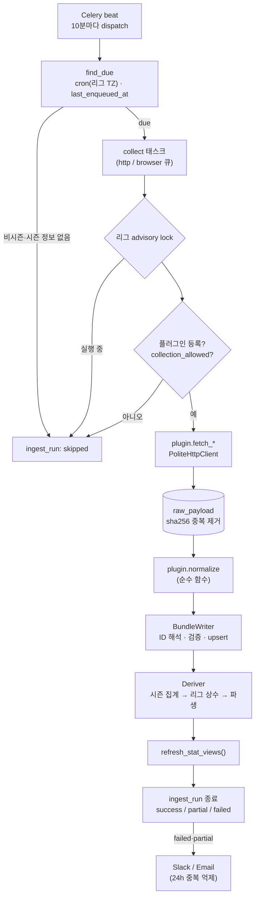

# 3단계 · 수집 플러그인 공통 인터페이스 + 수집 파이프라인

> 상태: **공통 인터페이스·파이프라인 완료, KBO 수집기는 보류**
> KBO 수집기는 소스 사이트 확인이 선행되어야 한다. 이유와 필요한 조치는 [§6](#6-kbo-수집기-보류-사유와-다음-조치)에 정리했다.

---

## 1. 구성

```
backend/collectors/
  core/
    interface.py   CollectorPlugin (fetch_* + normalize), RawDocument, RunContext, MatchTarget, SeasonRef
    dto.py         정규화 DTO (시즌·스테이지·팀·선수·경기장·경기·구간·명단·기록·순위·명단 이력·이벤트)
    http.py        PoliteHttpClient: 수집 허용 게이트, robots.txt, 도메인별 간격, 재시도/백오프
    registry.py    @register_collector + collectors.plugins 패키지 자동 탐색
    raw_store.py   원문 저장(sha256 중복 제거, gzip), 재처리용 로드
    writer.py      외부 ID 해석 → 자연키 upsert (변경분만), 지표 검증, 거부/경고 집계
    runner.py      한 리그·작업 실행: 락 → 로그 → fetch → raw → normalize → 저장 → 파생 → MV → 알림
    dispatch.py    cron(리그 타임존) due 판정 + 비시즌 건너뛰기
    alerts.py      Slack Webhook / 이메일, 24시간 중복 알림 억제
  plugins/         종목·리그별 플러그인 (자동 탐색 대상) — 현재 비어 있음
backend/stats_engine/
  catalog.py       DB 종목 설정 → 메모리 카탈로그 (검증·계산 공용)
  derive.py        시즌 집계, 리그 상수, 파생 지표 배치 계산
backend/worker/celery_app.py   Celery: dispatch(beat) / collect(큐: http, browser)
```

## 2. 실행 흐름



- **문서 단위 격리:** 문서마다 별도 트랜잭션으로 처리한다. 한 문서가 실패해도 나머지는 저장되고, 실패한 문서는 `raw_payload.parse_status = failed`로 남는다. 실행 상태는 `partial`이 된다.
- **행 단위 격리:** 참조를 해석할 수 없는 행(없는 팀·경기 등)은 savepoint로 버리고 `*.rejected`로 센다.
- **값 검증:** `stat_definition`에 없는 키, 파생 지표 키, 레벨·주체가 맞지 않는 키는 버리고 경고로 남긴다.
- **변경분만 갱신:** `IS DISTINCT FROM` 조건으로 값이 바뀐 행만 UPDATE한다. 실행 로그 `counts`에 테이블별 inserted/updated/unchanged/rejected 건수가 남는다.
- **부분 갱신:** DTO 필드가 `None`이면 "제공되지 않음"으로 보고 기존 값을 유지한다. `attrs`는 병합한다.
- **이상 징후:** 박스스코어 작업 후 종료된 경기에 선수 기록이 없으면 경고로 남기고, 부분 실패 알림 대상이 된다.

## 3. 작업 종류와 플러그인 메서드

| job_type | 플러그인 메서드 | 대상 선택 |
|---|---|---|
| `schedule` | `fetch_schedule(ctx, date_from, date_to)` | 오늘 기준 `days_back` ~ `days_ahead` (스케줄 params) |
| `results` / `boxscore` / `events` | `fetch_match(ctx, match, parts)` | DB에서 이 소스로 매핑된 경기 중 `recheck_days` 이내 (취소·연기 제외) |
| `season_stats` | `fetch_player_stats(ctx, season)` | `plugin.season_for_date(today)` |
| `standings` | `fetch_standings(ctx, season)` | 동일 |
| `roster` / `players` | `fetch_roster(ctx, season)` | 동일 |

제공하지 않는 작업은 `NotSupported`를 던지면 경고만 남기고 성공 처리한다.

## 4. 파생 지표 계산 규칙

1. **시즌 집계** (`origin = aggregated`): 종료 경기의 경기 전체 행을 `aggregation`(sum/avg/max/min/last)대로 합친다. 선수는 팀별 행과 합산 행(`team_id NULL`)을 모두 만든다.
2. **리그 상수:** 정규시즌 팀 시즌 기록의 합계로 수식 상수를 계산한다. 팀 기록은 `collected`가 있으면 우선하고 없으면 `aggregated`를 쓴다. `manual`/`collected` 상수는 덮어쓰지 않는다. 상수가 바뀌면 시즌 전체 기록을 다시 계산한다.
3. **파생 지표:** 팀 행을 먼저 계산하고(선수 수식의 `team.*` 참조용), 이어서 선수 행을 계산한다. 비율 지표는 평균하지 않고 합쳐진 원시 값으로 다시 계산한다.
4. **0 채움:** 한 행에 어떤 카테고리의 지표가 하나라도 있으면, 같은 카테고리의 합계형 원시 지표 중 빠진 것은 0으로 본다. 박스스코어는 0인 항목(예: 3루타 0개)을 생략하는 경우가 많기 때문이다. 0으로 나누게 되면 값은 None이 되어 저장하지 않는다.

## 5. 새 수집 플러그인 작성 가이드

```python
# backend/collectors/plugins/<종목>_<리그>/plugin.py
from collectors.core.interface import CollectorPlugin
from collectors.core.registry import register_collector
from collectors.core import dto as d

@register_collector
class KblOfficialPlugin(CollectorPlugin):
    key = "kbl_official"          # config/leagues/kbl.yaml 의 collector_key
    sport_code = "basketball"     # config/sports/basketball.yaml
    source_code = "kbl_official"  # config/sources/kbl_official.yaml
    parser_version = 1            # 파서를 바꾸면 올리고 `reprocess` 실행

    def season_for_date(self, league_code, d):        # 연도를 넘는 시즌이면 재정의 ('2025-26')
        ...

    def fetch_schedule(self, ctx, date_from, date_to):
        yield ctx.http.get(url, document_type="schedule", external_key=f"{date_from}~{date_to}")

    def fetch_match(self, ctx, match, parts):
        ...

    def normalize(self, doc, league_code) -> d.NormalizedBundle:
        # 네트워크·DB 접근 금지. 지표 키는 stat_definition 코드 (파생 지표 제외)
        ...
```

체크리스트
1. 소스의 robots.txt와 이용약관을 확인하고 `config/sources/<code>.yaml`의 `terms_note`에 기록한다. 허용될 때만 `collection_allowed: true`로 바꾼다.
2. 실제 응답 샘플을 `backend/tests/fixtures/<plugin>/`에 저장하고, `normalize` 단위 테스트를 작성한다. 파서 테스트는 네트워크 없이 돈다.
3. 이닝·시간처럼 표기 변환이 필요한 값은 `normalize`에서 공통 단위(아웃카운트, 초)로 바꾼다.
4. `python -m app.cli collect --league <CODE> --job schedule`로 1회 실행하고 `ingest.ingest_run`의 counts와 warnings를 확인한다.

## 6. KBO 수집기 보류 사유와 다음 조치

**사유:** 이 작업 환경의 네트워크 정책이 `www.koreabaseball.com` 접속을 차단한다(프록시 403). 그래서 다음을 할 수 없었다.
- robots.txt·이용약관 확인 (수집 허용 여부)
- 실제 페이지 구조 확인. 요구사항대로 구조를 추측해 파서를 만들지 않았다.

**필요한 조치 (택1)**
1. **환경 네트워크 허용 목록에 `www.koreabaseball.com` 추가:** 약관·robots.txt를 확인하고, 실제 응답을 테스트 픽스처로 저장한 뒤 파서를 작성한다. 가장 권장하는 방법이다.
2. **KBO 페이지 원본(HTML) 파일 제공:** 일정·박스스코어·기록·순위 페이지를 저장해 `backend/tests/fixtures/kbo/`에 넣어 주면 파서를 작성할 수 있다. 이 경우 약관 확인은 운영자가 직접 해야 한다.

**그 동안 동작 상태:** KBO 리그는 등록되어 있지만 수집기(`kbo_official`)가 없어, 디스패처가 실행하면 `skipped: 플러그인 미등록`으로 기록된다. 소스도 `collection_allowed: false`라 플러그인을 추가해도 허용 전까지 요청을 보내지 않는다.

## 7. 테스트 (19개 추가, 총 65개)

| 파일 | 내용 |
|---|---|
| `tests/test_http_client.py` | 수집 비허용 시 요청 0건, robots.txt 금지·캐시, robots 없음(허용)/서버 오류(차단), 503 재시도·백오프, 네트워크 오류 재시도, 404 재시도 안 함, 최대 재시도, 도메인 간격 |
| `tests/test_collection_pipeline.py` | 가짜 플러그인·가짜 HTTP로 일정 → 재실행 멱등 → 박스스코어(키 검증·거부·파생·시즌 집계·LG_ERA/FIP 상수·MV) → 이벤트(파티션) → raw 재처리(HTTP 0건, 파서 v2 반영) → 비허용 소스/미등록 플러그인/동시 실행 건너뜀 → 실패 알림 1회 → 디스패처(due·비시즌·주 1회·놓친 발화) → **`app_ingest` 권한으로 전 과정 실행** |

`tests/fake_plugin.py`는 공통 파이프라인 검증용 최소 플러그인이다. 실제 소스 구조를 흉내 내지 않는다.

## 8. 2단계 스키마 변경

- `0008_ingest_functions`: `util.ensure_event_partition`을 SECURITY DEFINER로 바꿔 `app_ingest`에만 실행을 허용했다. `util.collect_lock_key` 함수를 추가했고, `core.season`과 `core.competition_stage`에 `ingest_run_id` 컬럼을 추가했다(출처 추적 일관성).
