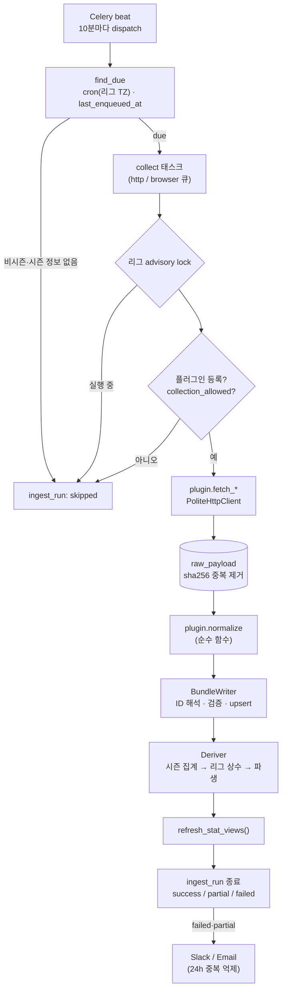

# 3단계 · 수집 플러그인 공통 인터페이스 + 수집 파이프라인

> 상태: **완료** — 공통 인터페이스·파이프라인 + KBO 수집기(GitHub 공개 데이터, 실제 수집 확인). [§6](#6-kbo-수집기) 참고.

---

## 1. 구성

```
backend/collectors/
  core/
    interface.py   CollectorPlugin (fetch_* + normalize), RawDocument, RunContext, MatchTarget, SeasonRef
    dto.py         정규화 DTO (시즌·스테이지·팀·선수·경기장·경기·구간·명단·기록·순위·명단 이력·이벤트)
    http.py        PoliteHttpClient: 수집 허용 게이트, robots.txt, 도메인별 간격, 재시도/백오프
    registry.py    @register_collector + collectors.plugins 패키지 자동 탐색
    raw_store.py   원문 저장(sha256 중복 제거, gzip), 재처리용 로드
    writer.py      외부 ID 해석 → 자연키 upsert (변경분만), 지표 검증, 거부/경고 집계
    runner.py      한 리그·작업 실행: 락 → 로그 → fetch → raw → normalize → 저장 → 파생 → MV → 알림
    dispatch.py    cron(리그 타임존) due 판정 + 비시즌 건너뛰기
    alerts.py      Slack Webhook / 이메일, 24시간 중복 알림 억제
  plugins/         종목·리그별 플러그인 (자동 탐색 대상)
    baseball_kbo/  KBO: plugin.py(작업·소스 연결), schedule.py(일정·결과), records.py(시즌 기록·순위·프로필), common.py(구단 표·이닝 변환)
backend/stats_engine/
  catalog.py       DB 종목 설정 → 메모리 카탈로그 (검증·계산 공용)
  derive.py        시즌 집계, 리그 상수, 파생 지표 배치 계산
backend/worker/celery_app.py   Celery: dispatch(beat) / collect(큐: http, browser)
```

## 2. 실행 흐름



- **문서 단위 격리:** 문서마다 별도 트랜잭션으로 처리한다. 한 문서가 실패해도 나머지는 저장되고, 실패한 문서는 `raw_payload.parse_status = failed`로 남는다. 실행 상태는 `partial`이 된다.
- **행 단위 격리:** 참조를 해석할 수 없는 행(없는 팀·경기 등)은 savepoint로 버리고 `*.rejected`로 센다.
- **값 검증:** `stat_definition`에 없는 키, 파생 지표 키, 레벨·주체가 맞지 않는 키는 버리고 경고로 남긴다.
- **변경분만 갱신:** `IS DISTINCT FROM` 조건으로 값이 바뀐 행만 UPDATE한다. 실행 로그 `counts`에 테이블별 inserted/updated/unchanged/rejected 건수가 남는다.
- **부분 갱신:** DTO 필드가 `None`이면 "제공되지 않음"으로 보고 기존 값을 유지한다. `attrs`는 병합한다.
- **이상 징후:** 박스스코어 작업 후 종료된 경기에 선수 기록이 없으면 경고로 남기고, 부분 실패 알림 대상이 된다.

## 3. 작업 종류와 플러그인 메서드

| job_type | 플러그인 메서드 | 대상 선택 |
|---|---|---|
| `schedule` | `fetch_schedule(ctx, date_from, date_to)` | 오늘 기준 `days_back` ~ `days_ahead` (스케줄 params) |
| `results` / `boxscore` / `events` | `fetch_match(ctx, match, parts)` | DB에서 이 소스로 매핑된 경기 중 `recheck_days` 이내 (취소·연기 제외) |
| `season_stats` | `fetch_player_stats(ctx, season)` | `plugin.season_for_date(today)` |
| `standings` | `fetch_standings(ctx, season)` | 동일 |
| `roster` / `players` | `fetch_roster(ctx, season)` | 동일 |

제공하지 않는 작업은 `NotSupported`를 던지면 경고만 남기고 성공 처리한다.

## 4. 파생 지표 계산 규칙

1. **시즌 집계** (`origin = aggregated`): 종료 경기의 경기 전체 행을 `aggregation`(sum/avg/max/min/last)대로 합친다. 선수는 팀별 행과 합산 행(`team_id NULL`)을 모두 만든다.
2. **리그 상수:** 정규시즌 팀 시즌 기록의 합계로 수식 상수를 계산한다. 팀 기록은 `collected`가 있으면 우선하고 없으면 `aggregated`를 쓴다. `manual`/`collected` 상수는 덮어쓰지 않는다. 상수가 바뀌면 시즌 전체 기록을 다시 계산한다.
3. **파생 지표:** 팀 행을 먼저 계산하고(선수 수식의 `team.*` 참조용), 이어서 선수 행을 계산한다. 비율 지표는 평균하지 않고 합쳐진 원시 값으로 다시 계산한다.
4. **0 채움:** 한 행에 어떤 카테고리의 지표가 하나라도 있으면, 같은 카테고리의 합계형 원시 지표 중 빠진 것은 0으로 본다. 박스스코어는 0인 항목(예: 3루타 0개)을 생략하는 경우가 많기 때문이다. 0으로 나누게 되면 값은 None이 되어 저장하지 않는다.

## 5. 새 수집 플러그인 작성 가이드

```python
# backend/collectors/plugins/<종목>_<리그>/plugin.py
from collectors.core.interface import CollectorPlugin
from collectors.core.registry import register_collector
from collectors.core import dto as d

@register_collector
class KblOfficialPlugin(CollectorPlugin):
    key = "kbl_official"          # config/leagues/kbl.yaml 의 collector_key
    sport_code = "basketball"     # config/sports/basketball.yaml
    source_code = "kbl_official"  # config/sources/kbl_official.yaml
    parser_version = 1            # 파서를 바꾸면 올리고 `reprocess` 실행

    def source_code_for(self, job_type):               # 작업마다 소스가 다를 때만 재정의 (KBO 플러그인 참고)
        ...

    def season_for_date(self, league_code, d):        # 연도를 넘는 시즌이면 재정의 ('2025-26')
        ...

    def fetch_schedule(self, ctx, date_from, date_to):
        yield ctx.http.get(url, document_type="schedule", external_key=f"{date_from}~{date_to}")

    def fetch_match(self, ctx, match, parts):
        ...

    def normalize(self, doc, league_code) -> d.NormalizedBundle:
        # 네트워크·DB 접근 금지. 지표 키는 stat_definition 코드 (파생 지표 제외)
        ...
```

체크리스트
1. 소스의 robots.txt와 이용약관을 확인하고 `config/sources/<code>.yaml`의 `terms_note`에 기록한다. 허용될 때만 `collection_allowed: true`로 바꾼다.
2. 실제 응답 샘플을 `backend/tests/fixtures/<plugin>/`에 저장하고, `normalize` 단위 테스트를 작성한다. 파서 테스트는 네트워크 없이 돈다.
3. 이닝·시간처럼 표기 변환이 필요한 값은 `normalize`에서 공통 단위(아웃카운트, 초)로 바꾼다.
4. `python -m app.cli collect --league <CODE> --job schedule`로 1회 실행하고 `ingest.ingest_run`의 counts와 warnings를 확인한다.

## 6. KBO 수집기

### 6.1 소스 선택 경위

| 후보 | 결과 |
|---|---|
| KBO 공식 사이트, 네이버 스포츠(API·화면), 스탯티즈, 다음 스포츠, MyKBO Stats, FanGraphs | 이 작업 환경에서 접속 차단. 다른 공개 프로젝트들도 KBO·스탯티즈는 robots.txt 로 사전 승인 없는 자동 수집을 금지한다고 기록하고 있다 |
| Kaggle, Hugging Face, data.go.kr, 위키백과 등 | 접속 차단 |
| **GitHub 공개 저장소** (raw.githubusercontent.com) | 접속 가능. 다른 사람들이 매일 자동 수집해 올리는 KBO 데이터를 찾아 평가했다 |

GitHub 에서 평가한 저장소:

| 저장소 | 내용 | 판단 |
|---|---|---|
| [comographer/kbo-crawler](https://github.com/comographer/kbo-crawler) | KBO 일정 서비스 응답 원본(월별), 2015~2026 정규·포스트시즌, 매일 23:55 KST | **채택 — 일정·결과** |
| [PsyproLEE/KBO_statics](https://github.com/PsyproLEE/KBO_statics) | KBO 기록실 선수 시즌 기록(선수 ID 포함)·순위·프로필, 1982~2026, 매일 00:30 KST 예약(9월 한 달 매일 커밋 확인) | **채택 — 시즌 기록·순위·선수** |
| [dentearl/kbo-data](https://github.com/dentearl/kbo-data) | 2021~2026 경기 결과 JSON (구장·포스트시즌 없음) | 교차 검증에만 사용 (2026 종료 675·연기 73경기 일치) |
| [cgpropz/kbo](https://github.com/cgpropz/kbo) | 베팅용 선수 경기 로그 (영문 이름, 일부 선수만, 투수는 선발 위주) | 제외 — 불완전해서 집계가 틀어진다 |
| Sssss-Mmm/kbo-stat, Seunggon-Kim/b_project, kbo-data-portal, KBO_workbench 등 | 저장소에 데이터 파일이 없거나 2025년에 멈춤 | 제외 |

### 6.2 약관·수집 허용

| 소스 코드 | 대상 | robots.txt | 조건 | `collection_allowed` |
|---|---|---|---|---|
| `kbo_gh_schedule` | raw.githubusercontent.com/comographer/kbo-crawler | 없음(404 → 전체 허용) | GitHub 이용약관 범위의 공개 콘텐츠 열람. 라이선스 파일 없음 → 재배포하지 않고 내부(비공개) 분석용으로만 | `true` |
| `kbo_gh_stats` | raw.githubusercontent.com/PsyproLEE/KBO_statics | 없음(404 → 전체 허용) | 같음 | `true` |
| `kbo_official` | www.koreabaseball.com | 미확인(접속 차단) | 자동 수집 금지로 알려져 사용하지 않음 | `false` |

요청은 실행당 3~11건(월별 파일 1~2개, 기록 파일 3~5개)이고 도메인별 3초 간격을 지킨다.

### 6.3 작업과 제공 범위

| 작업 | 요청 파일 | 저장 |
|---|---|---|
| `schedule` | `data/raw/{연도}/schedule_{연도}_{월}.json` (+ 9~11월은 `postseason/postseason_…json`, 없으면 건너뜀) — 기간에 걸친 달마다 | 시즌·스테이지(REG, POST)·팀·구장·경기(상태·점수·더블헤더 순번·중계·취소 사유) |
| `results` | 대상 경기가 속한 달의 같은 파일 (달마다 1회) | 경기 상태·점수 갱신 |
| `season_stats` | `meta.json` → 현재 시즌이면 `hitters/pitchers/players.json`, 지난 시즌이면 `season/{연도}.json` | 선수(한글 이름·생년월일·키·몸무게·포지션·투타) · 선수 시즌 기록 · 팀 시즌 기록(소속 선수 합산) |
| `standings` | `meta.json` + `standings.json` (지난 시즌은 `season/{연도}.json`) | 순위, `std.G/W/L/D/GB` (기준일 = meta.updatedAt, 지난 시즌은 12-31 최종) |
| `boxscore`, `events`, `roster` | — | 미지원 (`NotSupported` → 경고만 남기고 성공) |

지난 시즌 백필: `python -m app.cli collect --league KBO --job season_stats --param date=2025-06-01` (1982년부터 가능).

**변환 규칙**
- 경기 ID: KBO gameId(`20260901LGOB0` = 날짜 + 원정 + 홈 + 더블헤더 번호). 취소 경기는 링크가 없어 같은 형식으로 만든다.
- 상태: 점수(class win/lose/same) 있음 → final, 비고에 취소 사유 → postponed(KBO 는 새 gameId 로 재편성), 그 외 → scheduled.
- 선수: KBO 선수 ID(`playerId`)를 외부 ID 로 쓴다. 타자·투수 명단에 모두 있는 선수는 한 행으로 합친다.
- 이닝 `'224 2/3'` → 아웃카운트 674. 파생 지표(AVG, OPS, ERA, WHIP …)는 저장하지 않고 공통 계산기로 다시 계산한다.
- **미집계 항목:** 한 시즌에 모든 선수가 0 인 지표는 그 시즌에 집계하지 않은 것으로 보고 뺀다
  (예: 1982년 투구 수·QS·홀드·고의4구·폭투·보크). 0 을 "기록 없음"과 구분하기 위해서다.
- **구단 계승:** 옛 구단명은 계승 구단에 연결한다. MBC→LG, 해태→KIA, OB→두산, 빙그레→한화, SK→SSG,
  우리·히어로즈·넥센→키움. 해체 구단은 내부 코드로 둔다: 삼미·청보·태평양·현대→`HD`(현대 유니콘스), 쌍방울→`SB`.
  옛 명칭은 `team.attrs.former_names` 에 남긴다(writer 가 `core.team_name_history` 를 아직 쓰지 않음).

### 6.4 실제 수집 결과 (2026-09-30, 로컬 DB)

| 실행 | 작업 | 결과 | 요청 | 비고 |
|---|---|---|---|---|
| 1 | schedule (2026-03-01 ~ 10-31) | success | 11 | 경기 782 (종료 675, 연기 73, 예정 34), 구장 등 |
| 2 | results (최근 5일) | success | 3 | 변경 없음 |
| 3 | season_stats (2026) | success | 5 | 선수 587, 선수 시즌 기록 587, 팀 기록 10, 파생 597행 |
| 4 | standings (2026) | success | 3 | 10팀 |
| 5·6 | season_stats·standings (2025 백필) | success | 3·3 | |

검증: 경기 결과로 계산한 팀별 승·패·무가 순위표(다른 저장소)와 10팀 모두 일치했다. 리그 상수(LG_ERA 4.689, FIP_C 3.585)와
파생 지표(타율·OPS·ERA·FIP)가 계산되었다. 경고 0건.

### 6.5 한계

1. **경기별 선수 기록(박스스코어)·문자중계 없음.** 온전한 공개 데이터를 찾지 못했다. 선수 기록은 시즌 누적만 있다
   → 최근 폼·경기별 스플릿·상대 투수 유형 스플릿은 아직 만들 수 없다.
2. **팀 시즌 기록은 소속 선수 합산**이다. KBO 기록실은 이적 선수의 시즌 기록을 현재 소속팀에 모두 표시하므로
   팀별 값은 이적 선수만큼 다를 수 있다. 리그 전체 합계(리그 상수)는 정확하다.
3. **제3자 저장소 의존.** 저장소가 멈추거나 구조를 바꾸면 수집이 실패·경고로 남는다(실패 알림 대상). 갱신이 멈췄는지는
   `meta.json` 의 `updatedAt` 과 순위 기준일로 확인할 수 있다.
4. 포스트시즌 경기는 라운드(와일드카드·준PO·PO·KS)를 구분하지 않고 한 스테이지(POST)로 저장한다.
5. 1군 등록 현황(roster)은 지원하지 않는다.

### 6.6 공통 코드 변경 (최소)

- `CollectorPlugin.source_code_for(job_type)` 추가(기본값 `source_code`). runner 는 이 값으로 소스(수집 허용·요청 간격·외부 ID 매핑 기준)를 고른다.
  KBO 는 일정과 기록의 소스가 다르기 때문이다. 기존 플러그인 동작은 바뀌지 않는다.
- `app.cli reprocess --job <작업>` 옵션: 작업별 소스가 다른 플러그인에서 재처리할 원문의 소스를 고른다(기본 `schedule`, 기존과 같음).
- 의존성 `beautifulsoup4` 추가(일정 셀의 HTML 조각 파싱).
- 2단계 테스트의 "모든 소스 수집 비허용" 검사를 "약관 확인을 기록한 소스만 허용"으로 바꿨다.

## 7. 테스트 (3단계 공통 19개 + KBO 26개, 총 91개)

| 파일 | 내용 |
|---|---|
| `tests/test_http_client.py` | 수집 비허용 시 요청 0건, robots.txt 금지·캐시, robots 없음(허용)/서버 오류(차단), 503 재시도·백오프, 네트워크 오류 재시도, 404 재시도 안 함, 최대 재시도, 도메인 간격 |
| `tests/test_collection_pipeline.py` | 가짜 플러그인·가짜 HTTP로 일정 → 재실행 멱등 → 박스스코어(키 검증·거부·파생·시즌 집계·LG_ERA/FIP 상수·MV) → 이벤트(파티션) → raw 재처리(HTTP 0건, 파서 v2 반영) → 비허용 소스/미등록 플러그인/동시 실행 건너뜀 → 실패 알림 1회 → 디스패처(due·비시즌·주 1회·놓친 발화) → **`app_ingest` 권한으로 전 과정 실행** |

| `tests/test_kbo_plugin.py` | **실제 파일 픽스처**로 이닝 변환, 구단 계승 매핑, 일정(종료·연기·예정·무승부·더블헤더·포스트시즌·빈 달·구조 변경 시 오류), 시즌 기록(겸업 선수 병합, 프로필, 팀 합산, 1982년 미집계 항목 제외), 순위, 작업별 소스, 달 단위 요청·포스트시즌 404 건너뜀 / **통합(db)**: 일정 → 결과 → 미지원 박스스코어 → 시즌 기록(일정의 팀과 같은 행 연결, 파생·리그 상수) → 순위 → 1982 백필 → 재실행 멱등 |

`tests/fake_plugin.py`는 공통 파이프라인 검증용 최소 플러그인이다. 실제 소스 구조를 흉내 내지 않는다.

## 8. 2단계 스키마 변경

- `0008_ingest_functions`: `util.ensure_event_partition`을 SECURITY DEFINER로 바꿔 `app_ingest`에만 실행을 허용했다. `util.collect_lock_key` 함수를 추가했고, `core.season`과 `core.competition_stage`에 `ingest_run_id` 컬럼을 추가했다(출처 추적 일관성).
