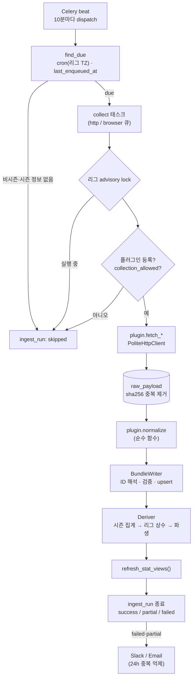

# 3단계 · 수집 플러그인 공통 인터페이스 + 수집 파이프라인

> 상태: **공통 인터페이스·파이프라인 완료, KBO 수집기 구현 완료(실수집 대기)**
> KBO 수집기는 이전 kbo-dashboard 프로젝트의 검증된 수집 방식을 옮겨 구현했다. 다만 이 작업 환경에서는 소스 호스트가
> 막혀 있어 약관·robots.txt·실제 응답을 확인하지 못했고, 두 소스 모두 수집 비허용 상태로 두었다. [§6](#6-kbo-수집기) 참고.

---

## 1. 구성

```
backend/collectors/
  core/
    interface.py   CollectorPlugin (fetch_* + normalize), RawDocument, RunContext, MatchTarget, SeasonRef
    dto.py         정규화 DTO (시즌·스테이지·팀·선수·경기장·경기·구간·명단·기록·순위·명단 이력·이벤트)
    http.py        PoliteHttpClient: 수집 허용 게이트, robots.txt, 도메인별 간격, 재시도/백오프
    registry.py    @register_collector + collectors.plugins 패키지 자동 탐색
    raw_store.py   원문 저장(sha256 중복 제거, gzip), 재처리용 로드
    writer.py      외부 ID 해석 → 자연키 upsert (변경분만), 지표 검증, 거부/경고 집계
    runner.py      한 리그·작업 실행: 락 → 로그 → fetch → raw → normalize → 저장 → 파생 → MV → 알림
    dispatch.py    cron(리그 타임존) due 판정 + 비시즌 건너뛰기
    alerts.py      Slack Webhook / 이메일, 24시간 중복 알림 억제
  plugins/         종목·리그별 플러그인 (자동 탐색 대상)
    baseball_kbo/  KBO: plugin.py(작업·소스 연결), naver.py(일정·박스스코어 JSON), kbo_html.py(순위·팀 기록 HTML), common.py
backend/stats_engine/
  catalog.py       DB 종목 설정 → 메모리 카탈로그 (검증·계산 공용)
  derive.py        시즌 집계, 리그 상수, 파생 지표 배치 계산
backend/worker/celery_app.py   Celery: dispatch(beat) / collect(큐: http, browser)
```

## 2. 실행 흐름



- **문서 단위 격리:** 문서마다 별도 트랜잭션으로 처리한다. 한 문서가 실패해도 나머지는 저장되고, 실패한 문서는 `raw_payload.parse_status = failed`로 남는다. 실행 상태는 `partial`이 된다.
- **행 단위 격리:** 참조를 해석할 수 없는 행(없는 팀·경기 등)은 savepoint로 버리고 `*.rejected`로 센다.
- **값 검증:** `stat_definition`에 없는 키, 파생 지표 키, 레벨·주체가 맞지 않는 키는 버리고 경고로 남긴다.
- **변경분만 갱신:** `IS DISTINCT FROM` 조건으로 값이 바뀐 행만 UPDATE한다. 실행 로그 `counts`에 테이블별 inserted/updated/unchanged/rejected 건수가 남는다.
- **부분 갱신:** DTO 필드가 `None`이면 "제공되지 않음"으로 보고 기존 값을 유지한다. `attrs`는 병합한다.
- **이상 징후:** 박스스코어 작업 후 종료된 경기에 선수 기록이 없으면 경고로 남기고, 부분 실패 알림 대상이 된다.

## 3. 작업 종류와 플러그인 메서드

| job_type | 플러그인 메서드 | 대상 선택 |
|---|---|---|
| `schedule` | `fetch_schedule(ctx, date_from, date_to)` | 오늘 기준 `days_back` ~ `days_ahead` (스케줄 params) |
| `results` / `boxscore` / `events` | `fetch_match(ctx, match, parts)` | DB에서 이 소스로 매핑된 경기 중 `recheck_days` 이내 (취소·연기 제외) |
| `season_stats` | `fetch_player_stats(ctx, season)` | `plugin.season_for_date(today)` |
| `standings` | `fetch_standings(ctx, season)` | 동일 |
| `roster` / `players` | `fetch_roster(ctx, season)` | 동일 |

제공하지 않는 작업은 `NotSupported`를 던지면 경고만 남기고 성공 처리한다.

## 4. 파생 지표 계산 규칙

1. **시즌 집계** (`origin = aggregated`): 종료 경기의 경기 전체 행을 `aggregation`(sum/avg/max/min/last)대로 합친다. 선수는 팀별 행과 합산 행(`team_id NULL`)을 모두 만든다.
2. **리그 상수:** 정규시즌 팀 시즌 기록의 합계로 수식 상수를 계산한다. 팀 기록은 `collected`가 있으면 우선하고 없으면 `aggregated`를 쓴다. `manual`/`collected` 상수는 덮어쓰지 않는다. 상수가 바뀌면 시즌 전체 기록을 다시 계산한다.
3. **파생 지표:** 팀 행을 먼저 계산하고(선수 수식의 `team.*` 참조용), 이어서 선수 행을 계산한다. 비율 지표는 평균하지 않고 합쳐진 원시 값으로 다시 계산한다.
4. **0 채움:** 한 행에 어떤 카테고리의 지표가 하나라도 있으면, 같은 카테고리의 합계형 원시 지표 중 빠진 것은 0으로 본다. 박스스코어는 0인 항목(예: 3루타 0개)을 생략하는 경우가 많기 때문이다. 0으로 나누게 되면 값은 None이 되어 저장하지 않는다.

## 5. 새 수집 플러그인 작성 가이드

```python
# backend/collectors/plugins/<종목>_<리그>/plugin.py
from collectors.core.interface import CollectorPlugin
from collectors.core.registry import register_collector
from collectors.core import dto as d

@register_collector
class KblOfficialPlugin(CollectorPlugin):
    key = "kbl_official"          # config/leagues/kbl.yaml 의 collector_key
    sport_code = "basketball"     # config/sports/basketball.yaml
    source_code = "kbl_official"  # config/sources/kbl_official.yaml
    parser_version = 1            # 파서를 바꾸면 올리고 `reprocess` 실행

    def source_code_for(self, job_type):               # 작업마다 소스가 다를 때만 재정의 (KBO 플러그인 참고)
        ...

    def season_for_date(self, league_code, d):        # 연도를 넘는 시즌이면 재정의 ('2025-26')
        ...

    def fetch_schedule(self, ctx, date_from, date_to):
        yield ctx.http.get(url, document_type="schedule", external_key=f"{date_from}~{date_to}")

    def fetch_match(self, ctx, match, parts):
        ...

    def normalize(self, doc, league_code) -> d.NormalizedBundle:
        # 네트워크·DB 접근 금지. 지표 키는 stat_definition 코드 (파생 지표 제외)
        ...
```

체크리스트
1. 소스의 robots.txt와 이용약관을 확인하고 `config/sources/<code>.yaml`의 `terms_note`에 기록한다. 허용될 때만 `collection_allowed: true`로 바꾼다.
2. 실제 응답 샘플을 `backend/tests/fixtures/<plugin>/`에 저장하고, `normalize` 단위 테스트를 작성한다. 파서 테스트는 네트워크 없이 돈다.
3. 이닝·시간처럼 표기 변환이 필요한 값은 `normalize`에서 공통 단위(아웃카운트, 초)로 바꾼다.
4. `python -m app.cli collect --league <CODE> --job schedule`로 1회 실행하고 `ingest.ingest_run`의 counts와 warnings를 확인한다.

## 6. KBO 수집기

### 6.1 경위와 소스 선택

이 작업 환경의 네트워크 정책이 `www.koreabaseball.com` 을 막고 있다(프록시 403, 2026-09-28·30 재확인).
사용자 요청에 따라 이전 프로젝트 [jun-yoonsung/kbo-dashboard](https://github.com/jun-yoonsung/kbo-dashboard)
(Streamlit 대시보드, `kbo_scraper.py`)가 쓰던 수집 방식을 확인해 플러그인으로 옮겼다. 그 프로젝트의 소스는 두 곳이다.

| 소스 코드 | 호스트 | 이 플러그인에서 쓰는 작업 | 형식 |
|---|---|---|---|
| `naver_sports` | `api-gw.sports.naver.com` | schedule, results, boxscore | 공개 JSON (웹 화면용 게이트웨이) |
| `kbo_official` | `www.koreabaseball.com` | standings, season_stats | HTML |

대체 소스도 확인했지만 모두 이 환경에서 막혀 있다: 스탯티즈(`statiz.sporki.com`), 네이버 스포츠 화면(`m.sports.naver.com`),
다음 스포츠, MyKBO Stats, FanGraphs. 이전 대시보드도 스탯티즈·MyKBO Stats 는 로그인·봇 차단 때문에 쓰지 않았다.
**`api-gw.sports.naver.com` 도 이 환경에서 막혀 있어**, 두 소스 모두 실제 응답을 받아 보지 못했다.

### 6.2 약관·수집 허용 상태

| 소스 | robots.txt | 이용약관 | `collection_allowed` |
|---|---|---|---|
| `kbo_official` | 미확인 (접속 차단) | 미확인 (사이트 하단 이용약관) | `false` |
| `naver_sports` | 미확인 (접속 차단) | 미확인. 네이버 이용약관에는 사전 허락 없는 자동화 수단 수집을 제한하는 조항이 있는 것으로 알려져 있어 내부 분석용이라도 원문 검토가 필요하다 | `false` |

허용 전까지 runner 는 요청 없이 `skipped` 로 기록한다(로컬 DB 에서 `collect --job schedule`, `--job standings` 실행으로 확인).
약관을 확인한 뒤 `config/sources/*.yaml` 의 `terms_note`·`collection_allowed` 를 고치고 `sync-config` 한다.

### 6.3 엔드포인트와 제공 범위

| 작업 | 요청 | 저장 |
|---|---|---|
| `schedule` | `GET /schedule/games?fields=basic,schedule,baseball&fromDate&toDate&categoryId=kbo` (최대 7일씩 나눠 요청) | 시즌·스테이지·팀·구장·경기(상태·점수·선발/승패투수·중계 attrs) |
| `results` | 대상 경기 날짜별 일정 1회 (같은 날짜 중복 요청 없음) | 경기 상태·점수 갱신 |
| `boxscore` | 위 일정 + `GET /schedule/games/{gameId}/record` (진행·종료·서스펜디드 경기만) | 선수 경기 기록 (타격·투구) |
| `season_stats` | `GET /Record/Team/Hitter/Basic1·2.aspx`, `/Record/Team/Pitcher/Basic1·2.aspx` → 원문 1건으로 묶음 | 팀 시즌 기록 (`origin=collected`) |
| `standings` | `GET /record/teamrank/teamrank.aspx` | 순위 (순위, `std.G/W/L/D/GB`) |
| `events`, `roster` | — | 미지원 (`NotSupported` → 경고만 남기고 성공) |

**변환 규칙**
- 스테이지: `roundCode` `kbo_r` → `REG`(정규시즌), `kbo_e` → `PRE`(시범경기). `kbo_as`(올스타전)는 제외한다.
  포스트시즌 코드는 확인되지 않아, 처음 보는 코드의 경기는 버리고 경고로 남긴다(확인 후 `naver.ROUND_STAGES` 에 추가).
- 경기 상태: `BEFORE` → scheduled, `LIVE` → live, `RESULT` → final, `CANCEL` → cancelled. 그 외는 경고 후 제외.
- 더블헤더: 같은 날 같은 대진을 시작 시각 순으로 `game_number` 1, 2 로 매긴다.
- 이닝: 네이버 `'6 ⅓'`, KBO `'1250 1/3'` 표기를 아웃카운트(`pit.OUTS`)로 바꾼다.
- 타자 박스스코어: `ab/hit/hr/rbi/run/sb/bb/kk` + 이닝별 결과 텍스트로 2루타(`좌2`)·3루타·사구·희생플라이(`…희비`)·희생번트(`…희번`)를 센다.
  타석 수는 제공되지 않아 `AB+BB+HBP+SF+SH` 로 계산한다(타격방해 출루는 빠진다).
- 투수 박스스코어: 같은 객체에 시즌 누적값(`gameCount, w, l, era`)이 섞여 있어 경기 값(`inn, er, hit, r, bb, kk, hr, pa, bf`)만 쓴다.
  `bf` 는 투구 수(`pit.NP`), `pa` 가 상대 타자(`pit.TBF`)다(대시보드에서 검증된 내용).
- 팀: 두 소스 모두 KBO 구단 코드(`LG, KT, SK, NC, OB, HT, LT, SS, HH, WO`)를 외부 ID 로, 정식 명칭을 `name_ko` 로 쓴다.
  writer 가 처음 보는 팀을 `name_ko` 로 찾기 때문에 두 소스의 팀이 같은 `core.team` 행에 연결된다(통합 테스트로 확인).
- 파생 지표(AVG, ERA, WHIP, OPS 등)는 저장하지 않고 공통 계산기로 다시 계산한다.

### 6.4 한계 (실제 응답 확인 후 보완할 것)

1. **실제 응답 미확인.** 파서와 픽스처(`backend/tests/fixtures/kbo/`, 합성)는 이전 대시보드 파서가 읽던 필드·선택자만 따른다.
   접속이 가능해지면 실제 응답을 픽스처로 추가하고, 다른 점이 있으면 파서와 `parser_version` 을 고친 뒤 `reprocess` 한다.
2. **선수 ID.** 대시보드는 박스스코어의 선수 코드 필드를 쓰지 않아 필드가 확인되지 않았다. 지금은 `구단코드:이름`
   (예: `LG:홍길동`)을 외부 ID 로 쓴다. 같은 팀 동명이인과 시즌 중 이적 선수는 구분하지 못한다. 선수 코드 필드가 확인되면
   외부 ID 를 바꾸고 기존 매핑을 옮겨야 한다.
3. **선수 시즌 기록은 박스스코어 집계만.** KBO 선수 기록 페이지는 GET 으로 첫 페이지(상위 일부)만 나오고, 전체 선수·과거 시즌은
   ASP.NET 포스트백(POST)이 필요하다. 공통 HTTP 클라이언트는 GET 전용이라 지원하지 않는다. 같은 이유로 과거 시즌 순위·팀 기록 백필도 없다.
4. **투수 승·패·세이브·홀드는 경기 단위로 없다.** 박스스코어에는 시즌 누적값만 있어 넣지 않았다. 시즌 값은 팀 시즌 기록(KBO)에만 있다.
5. **순위 기준일**은 페이지의 기준일 표기가 확인되지 않아 수집 시각(한국 날짜)을 쓴다.
6. **이닝별 점수, 관중, 경기 시간, 이벤트(문자중계), 1군 등록 현황**은 대시보드가 쓰지 않아 구조를 모르므로 수집하지 않는다.
7. 네이버 게이트웨이는 공식 공개 API 가 아니라 예고 없이 바뀔 수 있다.

### 6.5 공통 코드 변경 (최소)

- `CollectorPlugin.source_code_for(job_type)` 추가(기본값 `source_code`). runner 는 이 값으로 소스(수집 허용·요청 간격·외부 ID 매핑 기준)를 고른다.
  KBO 는 경기 데이터와 시즌 데이터의 소스가 다르기 때문이다. 기존 플러그인 동작은 바뀌지 않는다.
- `app.cli reprocess --job <작업>` 옵션: 작업별 소스가 다른 플러그인에서 재처리할 원문의 소스를 고른다(기본 `schedule`, 기존과 같음).
- 의존성 `beautifulsoup4` 추가(HTML 파싱).

## 7. 테스트 (3단계 공통 19개 + KBO 37개, 총 102개)

| 파일 | 내용 |
|---|---|
| `tests/test_http_client.py` | 수집 비허용 시 요청 0건, robots.txt 금지·캐시, robots 없음(허용)/서버 오류(차단), 503 재시도·백오프, 네트워크 오류 재시도, 404 재시도 안 함, 최대 재시도, 도메인 간격 |
| `tests/test_collection_pipeline.py` | 가짜 플러그인·가짜 HTTP로 일정 → 재실행 멱등 → 박스스코어(키 검증·거부·파생·시즌 집계·LG_ERA/FIP 상수·MV) → 이벤트(파티션) → raw 재처리(HTTP 0건, 파서 v2 반영) → 비허용 소스/미등록 플러그인/동시 실행 건너뜀 → 실패 알림 1회 → 디스패처(due·비시즌·주 1회·놓친 발화) → **`app_ingest` 권한으로 전 과정 실행** |

| `tests/test_kbo_plugin.py` | 이닝 변환, 팀 표기 통일, 네이버 일정(스테이지·상태·더블헤더·경고)·박스스코어(이닝 텍스트, 투수 시즌 누적값 제외, 투타 겸업), KBO 순위·팀 기록(페이지 병합, 모르는 머리글 경고, 구조 변경 시 오류), 지표 키가 원시 지표뿐인지, 작업별 소스, 7일 단위 분할 요청 / **통합(db)**: 일정 → 박스스코어(404 경기 격리, 예정·취소 경기 미요청, 파생·시즌 집계) → 순위·팀 기록(두 소스의 팀이 같은 행으로 연결) → 미지원 작업 경고 → 재실행 멱등 |

`tests/fake_plugin.py`는 공통 파이프라인 검증용 최소 플러그인이다. 실제 소스 구조를 흉내 내지 않는다.

## 8. 2단계 스키마 변경

- `0008_ingest_functions`: `util.ensure_event_partition`을 SECURITY DEFINER로 바꿔 `app_ingest`에만 실행을 허용했다. `util.collect_lock_key` 함수를 추가했고, `core.season`과 `core.competition_stage`에 `ingest_run_id` 컬럼을 추가했다(출처 추적 일관성).
